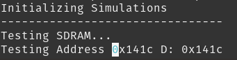
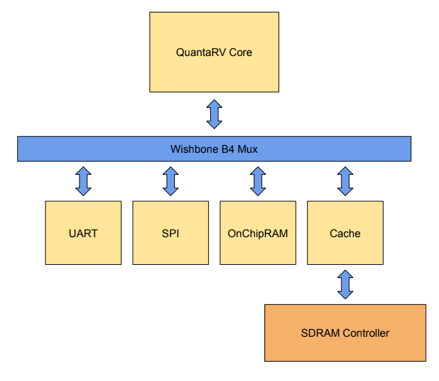

# QuantaRV
Serial 32bit RISCV Core. It takes about 120 cycles to execute each instruction, the whole current SoC fits on a Cyclone IV FPGA while consumming about 3000 LUTs.

Simulation of the SoC



# To implement
Extensions

- [X] I
- [ ] M
- [ ] A

Privilage Modes
- [X] M
- [ ] S  <- In Progress
- [ ] U


SoC Components
- [ ] DMA
- [ ] SDRAM Controller <- In Progress

To simulate you only need `iverilog` and do the following. That's assuming the code on c_code is compiled.

```
make
./a.out
```
# Current SoC


## Goal
The ultimate goal of the CPU is to run linux. The 1 Year boot.

# Memory Map
```
 ////////////////////////////
 //        MEMORY MAP      //
 ////////////////////////////
 ADDRESS         DEVICE
 0x0000-0x0fff   OnChipRAM
 0x1000-0x10ff   SPI
 0x1100-0x11ff   UART
 0x1200-0x12ff   Timer
 0x1300-0x13ff   GPIO
 0x1400-0xXXXX   SDRAM
 ```
## Timer Registers

```
BASE + 0x0000 - Time
BASE + 0x0008 - Time CMP
```

## SPI
```
      Memory Map

ADDRRESS SIZE   DESC
0x0000   32bit  RD_WR  Read and Write data
0x0004   8bit   CONFR
0x0008   32bit  DIVIDER
0x000c   32bit  TWP    Transmission Wait Period
0x0010   8bit   CS     Chip Select
0x0014   8bit   FLUSH RX BUFFER
0x0018   8bit   RX Capacity
0x001c   8bit   TX Capacity

CONFR Configuration Register

0    1    2    3    4    6    8    9  15
+----+----+----+----+----+----+----+---+
|CPOL|CPHA|TXQE|RXQE|TBM |RBM |RQFF|XXX|
+----+----+----+----+----+----+----+---+
CPOL - Clock Polarite/Clock IDDLE
CPHA - Clock Phase/Clock Shifting cycle
TXQE - Trasmitter Queue Enable
RXQE - Receiver Queue Enable
TBM  - Transmitter BUS MODE
RBM  - Receiver BUS MODE
RQFF - Receiver Queue Flush First
XXX  - Not used

TBM STATES
0x00 - Lock on FULL
0x01 - Error on FULL
0x02 - Retry on FULL 
0x03 - ACK on FULL 
RBM STATES
0x00 - Lock on Empty
0x01 - Error on Empty
0x02 - Retry on Empty
0x03 - ACK on Empty
```

## UART
```
 Internal Memory Map
 0x0000 - READ/WRITE
 0x0004 - Baud rate divisor
 0x0008 - Status/Control register

 ADDRESS LENGHT DESC
 0x0000  32bit  READ/WRITE TX/RX
 0x0004  32bit  Baud rate divisor
 0x0008  8bit   Control Register
 0x000c  8bit   RX Buffer Capacity
 0x0010  8bit   TX Buffer Capacity
 0x0014  8bit   Transfer Size
 0x0018  8bit   Stop Bits

 0x0008  8bit   Control Register
 +----+----+----+----+----+----+----+----+
 | TE | TF | RE | RF | PB | XX |    BB   |
 +----+----+----+----+----+----+----+----+
 TE - Transmitter Buffer Empty
 TF - Transmitter Buffer Full
 RE - Receiver Buffer Empty
 RF - Receiver Buffer Full
 PE - Paratiry Bit Enable
 XX - Not used
 BB - Bus Behavior  - Lock/Error/Retry/ack

 BB states
 0x00 Lock - Full or empty the uart will delay the ACK signal
 0x01 Error - Full or empty the uart will return retry
 0x02 Retry - Full or empty the uart will return error
 0x03 Ack - Full or empty the uart will return 0 on the bus
```